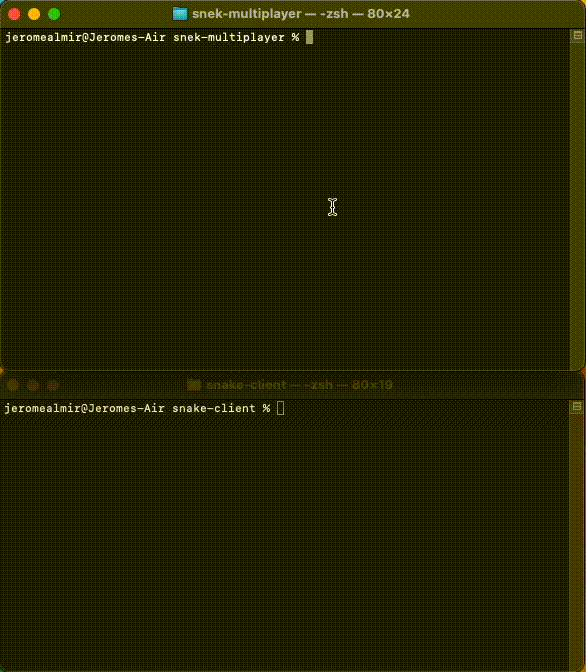

# Snake Client Project

Snake game is a very popular video game. It is a video game concept where the player maneuvers a dot and grows it by ‘eating’ pieces of food. As it moves and eats, it grows and the growing snake becomes an obstacle to smooth maneuvers. The goal is to grow it to become as big as possible without bumping into the side walls, or bumping into itself, upon which it dies.

This is simply a multiplayer take on the genre.

Before you can run this client, you will need to be running the server side which you can download and install from [here](https://github.com/lighthouse-labs/snek-multiplayer). 


## Purpose

This project was created and published by [Jerome Lagbas](https://github.com/jeromealmir) as part of the Web Development program at Lighthouse Labs.

## Game Trailer




## Getting Started

**Install Server and Game Client**
1. Clone and install game server
  ```
  git clone https://github.com/lighthouse-labs/snek-multiplayer
  cd snek-multiplayer
  npm install
  npm run play
  ```
2. Clone and install game client
  ```
  git clone https://github.com/jeromealmir/snake-client.git
  cd snake-client
  ```

**Starting the game**
- The server must be running before starting the game client! (*Refer to server installation instructions above*)
- Start the game client by typing the following in your client terminal window:  
`node play.js` <br />  
- \[OPTIONAL\] Set your player name (*max of 3 letters*) by appending 3 letters to the command:  
`node play.js SNK` <br />  

## Game Controls

**Movement Controls**
- Move up: Press <kbd>W</kbd>
- Move down: Press <kbd>S</kbd>
- Move right: Press <kbd>D</kbd>
- Move left: Press <kbd>A</kbd>

**In-Game Messages**
- Say: Let's go!: Press <kbd>G</kbd>
- Say: Howdy!: Press <kbd>H</kbd>
- Say: Goodbye!: Press <kbd>B</kbd>

**Quit the game**
-Press <kbd>Q</kbd> or <kbd>CTRL</kbd> + <kbd>C</kbd>